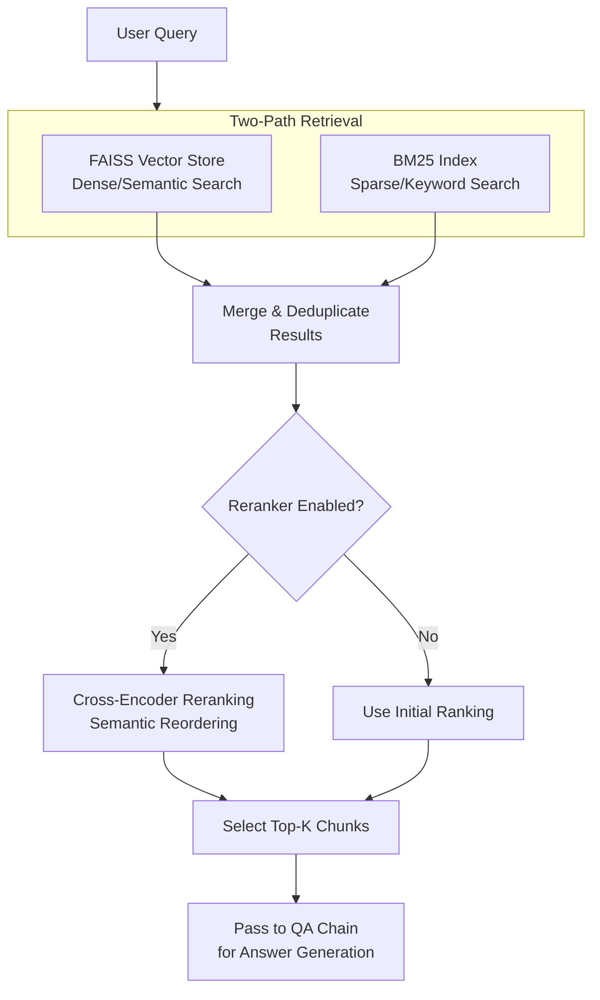

# Lumi - Your AI-Powered Study Assistant

Lumi is a Retrieval-Augmented Generation (RAG) application built with Streamlit and LangChain. It allows you to create a personalized knowledge base from your study materials (PDFs and YouTube videos) and ask questions to get detailed, source-backed answers and AI-generated analysis.


\*(Note: This screenshot shows the actual Lumi interface.) 

---

## ✨ Features

- **Multi-Source Ingestion:** Upload multiple PDFs or provide YouTube video URLs to build your knowledge base.
- **Collection Management:** Organize your documents into distinct collections for different subjects or topics.
- **Hybrid Search:** Combines dense vector search (FAISS) and sparse keyword search (BM25) for robust and relevant document retrieval.
- **Relevance Reranking:** Uses a `Cross-Encoder` model to re-rank retrieved documents, ensuring the most relevant context is passed to the language model.
- **Interactive Chat Interface:** A familiar chat UI to query your knowledge base and maintain conversation history.
- **Dual-Response System:**
  - **From Your Materials:** Provides a direct answer based *strictly* on the content of your uploaded documents.
  - **Lumi's Analysis:** Offers a separate, AI-generated analysis that synthesizes information, draws connections, and provides deeper insights.
- **Source-Backed Answers:** Every answer includes expandable references to the exact text chunks from the original documents.
- **Manual Chunk Selection:** For targeted questions, you can manually select specific text chunks to focus the AI's attention.
- **Configurable Retrieval:** Easily adjust the number of documents to retrieve (Top-K) and toggle the reranker on/off via the sidebar.

---

## 🛠️ Tech Stack

- **Frontend:** Streamlit
- **LLM Orchestration:** LangChain
- **LLM Provider:** Groq (using Llama 3 models for speed and performance)
- **Embeddings & Reranking:** Hugging Face Sentence-Transformers
- **Vector Store:** FAISS (in-memory)
- **Sparse Retrieval:** rank-bm25
- **Document Loading:** `PyPDF`, `yt-dlp`

---

## 🚀 Getting Started

Follow these steps to set up and run the project locally.

### 1. Prerequisites

- Python 3.9+


### 2. Clone the Repository

```bash
git clone https://github.com/duduBmoon21/naive-rag-system.git
cd naive-rag-system
```

### 3. Set Up a Virtual Environment

It's highly recommended to use a virtual environment to manage dependencies.

```bash
# For Windows
python -m venv venv
.\venv\Scripts\activate

# For macOS/Linux
python3 -m venv venv
source venv/bin/activate
```

### 4. Install Dependencies

Install all required packages from the `requirements.txt` file.

```bash
pip install -r requirements.txt
```

### 5. Set Up Environment Variables

This project requires an API key from Groq to use their language models.

1.  Create a file named `.env` in the root of the project directory.
2.  Sign up for a free account at the Groq Console ([Get it here](https://console.groq.com)) and create an API key.
3.  Add the key to your `.env` file like this:

    ```
    GROQ_API_KEY="gsk_YourSecretKeyGoesHere"
    ```

### 6. Run the Application

Launch the Streamlit app with the following command:

```bash
streamlit run app.py
```

The application will open in a new tab in your web browser.

---

## 📖 Usage Guide

### 1. Uploading Materials

* **PDFs:** Drag & drop or select files (200MB max each)
* **YouTube:** Paste URL (must have English captions)

### 2. Processing

* Click **"Process Materials"**
* Monitor real-time progress in the status window

### 3. Asking Questions

Here is an example of the two-part response format:

> **Question:** *What is Retrieval-Augmented Generation?*
>
> **🤖 Lumi's Answer:**
>
> **From Your Sources:**
>
> > RAG (Retrieval-Augmented Generation) is an AI framework for retrieving facts from an external knowledge base to ground large language models (LLMs) on the most accurate, up-to-date information and to give users insight into the LLMs' generative process.
> > *Source: `lecture_notes.pdf`, page 3*
>
> **Lumi's Analysis:**
>
> > This means that instead of just relying on its pre-trained knowledge, which can be outdated, a RAG system actively looks up current information before answering. Think of it like an open-book exam for an AI. It's a powerful technique to reduce hallucinations and build more trustworthy AI assistants, especially for specialized topics like your study materials.

* **Reset:** Click *"Start New Session"* to clear all data.

---

## 🛠 Technical Architecture

### Diagram



### Key Components

* **Streamlit UI**: Web front-end for user interaction, file uploads, and displaying results.
* **Document Loaders (`PyPDF`, `yt-dlp`)**: Extract text from PDFs and YouTube transcripts.
* **Hybrid Retrieval**: Combines dense semantic search (FAISS) and sparse keyword search (BM25).
* **Reranker (Cross-Encoder)**: Optionally reorders search results for better semantic relevance.
* **Top-K Chunk Selection**: Filters the most relevant chunks to pass to the QA chain.
* **LangChain QA Chain & Groq LLM**: Generates two-part answers: source-based content and independent analysis.

---

## 🔧 Troubleshooting

| Issue                         | Solution                                             |
| ----------------------------- | ---------------------------------------------------- |
| "No captions available"       | Try a different YouTube video with English subtitles |
| "PDF extraction failed"       | Ensure the PDF isn’t scanned/image-based             |
| Groq API errors               | Check your `.env` file and quota at the Groq Console |

---

## ❓ FAQs

**Q: Can I use private YouTube videos?**
A: Only if they have public captions enabled.

**Q: What PDF formats are supported?**
A: Text-based PDFs (not scanned documents).

**Q: How do I improve answer quality?**
A: Upload more related materials for better cross-referencing.

---

## 📂 Project Structure

```
naive-rag-system/
├── helpers/
│   ├── chain.py         # Defines the LangChain (LCEL) QA and analysis chain
│   ├── loader.py        # Utility for loading PDF documents
│   ├── reranker.py      # Handles Cross-Encoder reranking logic
│   ├── retriever.py     # Implements the HybridRetriever (FAISS + BM25)
│   └── youtube.py       # Utility for loading YouTube transcripts
├── .env.example         # Example environment file
├── app.py               # The main Streamlit application UI and logic
├── README.md            # This file
└── requirements.txt     # Project dependencies
```

---

## 🤝 Contributing

1. Fork the repository
2. Create a feature branch:

   ```bash
   git checkout -b feature/your-feature
   ```
3. Submit a pull request

---

## 📄 License

MIT License

## 🐛 Report Issues
Use [GitHub Issues](https://github.com/duduBmoon21/naive-rag-system/issues)
