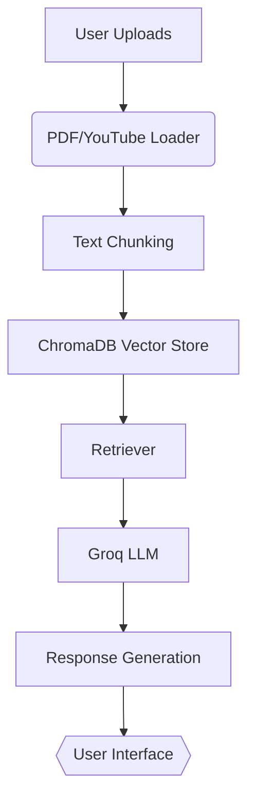

# Lumi Documentation

Your AI-powered Study Assistant

---

## 📌 Table of Contents

* [Overview](#-overview)
* [Features](#-features)
* [Installation](#️-installation)
* [Usage Guide](#-usage-guide)
* [Technical Architecture](#-technical-architecture)
* [Troubleshooting](#-troubleshooting)
* [FAQs](#-faqs)
* [Contributing](#-contributing)

---

## 🌐 Overview

Lumi is an AI-powered study assistant designed to make learning smarter and more efficient. It helps you:

* Extract insights from PDFs (lecture notes, research papers, books)
* Analyze YouTube videos (educational content with captions)
* Answer questions with **source-backed responses**
* Provide **AI-generated analysis** beyond the uploaded sources

**Built with:**

* RAG (Retrieval-Augmented Generation)
* LangChain & Groq (for fast LLM processing)
* ChromaDB (vector storage)

---

## ✨ Features

| Feature                | Description                                           |
| ---------------------- | ----------------------------------------------------- |
| Multi-Source Ingestion | Process multiple PDFs + YouTube videos simultaneously |
| Smart Q\&A             | Answers combine exact sources + AI analysis           |
| Cross-Referencing      | Connects concepts across different materials          |
| Transcript Cleaning    | Automatically cleans YouTube captions                 |
| Cache Management       | Automatic cleanup of temporary files                  |

---

## ⚙️ Installation

### Prerequisites

* Python 3.10+
* Groq API key ([Get it here](https://console.groq.com))

### Steps

1. **Clone the repository:**

   ```bash
   git clone https://github.com/duduBmoon21/naive-rag-system
   cd  naive-rag-system
   ```

2. **Install dependencies:**

   ```bash
   pip install -r requirements.txt
   ```

3. **Create `.env` file:**

   ```env
   GROQ_API_KEY=your_api_key_here
   ```

4. **Launch Lumi:**

   ```bash
   streamlit run app.py
   ```

---

## 📖 Usage Guide

### 1. Uploading Materials

* **PDFs:** Drag & drop or select files (200MB max each)
* **YouTube:** Paste URL (must have English captions)

### 2. Processing

* Click **"Process Materials"**
* Monitor real-time progress in the status window

### 3. Asking Questions

* Type your question (e.g., *"Summarize key points"*)
* Receive two-part answers:

  * **From Your Sources:** Exact references
  * **AI Analysis:** Interpretations & connections

### 4. Managing Sessions

* **Reset:** Click *"Start New Session"* to clear all data

---

## 🛠 Technical Architecture

### Diagram



### Key Components

* **app.py**: Streamlit UI and workflow control
* **helpers/loader.py**: Handles PDF/YouTube ingestion
* **helpers/retriever.py**: Manages vector search
* **helpers/chain.py**: Groq LLM response generation

---

## 🔧 Troubleshooting

| Issue                         | Solution                                             |
| ----------------------------- | ---------------------------------------------------- |
| "Failed to delete chroma\_db" | Restart the app or manually delete the folder        |
| "No captions available"       | Try a different YouTube video with English subtitles |
| "PDF extraction failed"       | Ensure the PDF isn’t scanned/image-based             |
| Groq API errors               | Check your `.env` file and quota at Groq Console     |

---

## ❓ FAQs

**Q: Can I use private YouTube videos?**
A: Only if they have public captions enabled.

**Q: What PDF formats are supported?**
A: Text-based PDFs (not scanned documents).

**Q: How do I improve answer quality?**
A: Upload more related materials for better cross-referencing.

---

## 🤝 Contributing

1. Fork the repository
2. Create a feature branch:

   ```bash
   git checkout -b feature/your-feature
   ```
3. Submit a pull request

---

## 📄 License

MIT License

## 🐛 Report Issues

Use [GitHub Issues](https://github.com/duduBmoon21/naive-rag-system/issues)
